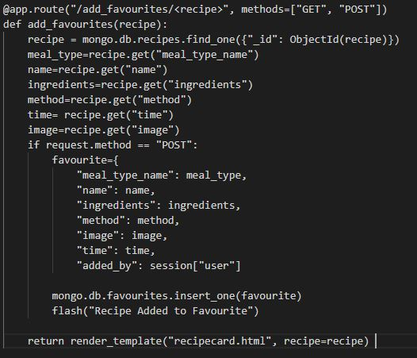
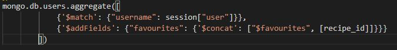

<h1>Manual Testing</h1>

<h3>Manual Testing of User Stories</h3>
<ol>
<li>As a user, I want to be able to view all of the recipes and to be able to search for recipes containing a specific word.</li>
<ul>
<li>By comparing the live recipes.html page with the recipes collection in MongoDB, I can see that all recipes currently listed are being parsed onto the page. If the number of recipes exceeds 6, the remaining recipes will be added to a new page which is correct as per the pagination function. This allows users to see all recipes but ensures the amount of data on the page is not too overwhelming. </li>
<li>By typing a keyword or name into the search bar, and clicking 'Search', a list of all recipes containing the above mentioned word is generated. Clicking the 'reset' button just brings back a list of all recipes.</li>
<li>A few issues were uncovered while testing this section. These are detailed in the below section with the fixes that were applied in order for the user story to now be fulfilled.
</ul>
<li>As a user, I want to be able to see the top three rated recipes at any given time.
</li>
<ul>
<li>By scrolling to the bottom of the index.html page, I can see the Leaderboard displayed.</li>
<li>To test that it is correctly displaying the current favourite recipes, I chose recipes that were not currently displayed and upvoted them numerous times. Going back to the index.html page I as able to see that the leaderboard had changed to reflect the newly upvoted recipes.</li>
</ul>
<li>As a user, I want to be able to see the type of dish, ingredients, method and time to make the recipe.</li>
<ul>
<li>Navigating to the recipes page, I am able to click on either the recipe name or the view button to display the recipecard for each recipe.</li>
<li>Once the recipecard is displayed, the type of recipe and time to make are already displayed. In order to see the ingredients and method in more details, I just need to click on the link for each collapsible and these details are displayed.</li>
</ul>
<li>As a user, I want to ability to create a profile by entering a username and password.</li>
<ul>
<li>By clicking on the 'register' link visible from the homepage, I am able to enter a username and password of my choice (minimum number of characters must be met).</li>
<li>By checking my MongoDB collection 'users' I am then able to see that this user and hashed password have been added.</li>
</ul>
<li>As a registered user, I want the ability to log in and log out of my account.</li>
<ul>
<li>I tested this using a previously created account. After clicking on the 'Log In' link and inputting the username and password I recieved a message to welcome me to my profile. Once logged in I was able to see more links such as 'add recipe' and 'my profile'. </li>
<li>The 'Log Out' link was also now visible and clicking this successfully ended the session and a message was displayed advising I had been logged out. The additional links are no longer visible.</li>
</ul> 
<li>As a registered user, I want to be able add recipes so that other user can view them.</li>
<ul>
<li>Once logged in, I am able to click on the 'Add Recipe' link in the navbar. A form is displayed allowing me to input details for the new recipes.</li>
<li>The meal type option is displayed as a drop down as there are only 4 categories that can be chosen.</li>
<li>The time has to be input in a specfic format to ensure it is then parsed correctly from the database.</li>
<li>The other form input are just text inputs. All of the form items are mandatory apart from the recipe image URL.</li>
<li>Once I have entered all of the required fields, clicking the submit button then displays a message to advise the recipe has been added.</li>
<li>Upon checking the MongoDB collection - recipes - I can see that the recipe has been added with all of the correct information. As I didn't enter an image URL, the generic image I set up was inputted instead which is the result I was expecting. This means that when parsed, an image will still be displayed.</li>
</ul>
<li>As a registered user, I want to be able to see all of my recipes via my Profile and have the ability to edit & delete them if required.</li>
<ul>
<li>Once logged in, I am redirected to my Profile. The first section of 'My Profile' page shows all of the recipes that I have added as this user. 
</li>
<li>I check these against the recipes collection on MongoDB and all of the recipes are showing correctly.</li>
<li>Each recipe has a 'delete' and an 'edit' button.</li>
<li>Upon clicking the 'delete' button a flash message is displayed advising the recipe has been deleted. The recipe has also been removed from the 'recipes' collection in MongoDB, the main recipes page and the section on the 'My Profile' page.</li>
<li>Upon clicking the 'edit' button, I am redirected to the 'Edit Recipe' page where I can update the details as required.</li>
<li>A bug was discovered because the image URL field was mandatory and I had not included the if statement to insert a generic image if none provided. Please see the below section for how this bug was fixed. </li>
</ul>
<li>As a registered user, I want to be able to add other user's recipes to 'My Favourites' and have easy access to them through my Profile.</li>
<ul>
<li>An issue arose early during the testing of this section meaning that even unregistered users could add recipes to their favourites which should not have been available to them. Please see below details of this and the fixes put in place.</li>
<li>After the fix & once logged in, I was able to view any recipe and once on the recipecard I was able to click on the 'Add to Favourites' button.</li>
<li>Then, by visiting 'My Profile' I am able to see the recipe in the 'My Favourites' section.</li>
</ul>
<li>As a registered user, I want to be able to vote (upvote or downvote) on other user's recipes.</li>
<ul>
<li>Once logged in, I can select a recipe to view and once on the recipecard page I can scroll to the bottom to see the options to vote.</li>
<li>There are two radio buttons with thumbs up and thumbs down next to them. Once I have selected one and clicked the 'Vote' button, I get a message to say 'Thank you for voting".</li>
</ul>
<li>As the admin user, I want to be able to remove and edit any recipe regardless of which user added it to the application.</li>
<ul>
<li>When logged in as 'Admin' and on the 'Recipes' page, I am able to see a 'delete' and 'edit' button for each recipe.</li>
<li>When clicking on'delete' the recipe is removed.</li>
<li>When clicking on 'edit' i am redirected to the 'Edit Reicipe' page and I can carry out edits on the recipe.</li>
</ul>
</ol>

<h3>Lighthouse</h3>
I have used Lighthouse to gain a performance score for this site. Please see below the results. 

<h3>Manual Testing of key aspects of the website</h3>
I manually tested the following to make sure they worked as designed:

<h5>Navbar & Collapsible Navbar</h5>
<ul>
<li>The largescreen navbar contains the logo and then the page links visible to the right hand side.</li>
<li>When on a smaller screen, the navbar links are moved into the collapsible navbar to the left hand side or the logo.</li>
<li>The full logo is always visible but the font size reduces as the screen size does to ensure this is possible.</li>
</ul>

<h5>Flashes</h5>
<ul>
<li>Flashes are enabled when a function is completed and I need to advise the user that a task has been completed successfully.</li>
<li>The flashes are used for the following:
<ul><li>Username Already Exists</li>
<li>Thank you for registering</li>
<li>Incorrect Username and/or Password</li>
<li>You have been logged out</li>
<li>Recipe Added</li>
<li>No results found</li>
<li>Added to favourites</li>
<li>Removed from favourites</li>
<li>Recipe Successfully deleted</li>
<li>Recipe updated</li>
<li>Thank you for voting</li></ul>
</li>
</ul>

<h5>Responsive Design</h5>
<ul>
<li></li>
<li></li>
</ul>

<h3>Bugs Discovered</h3>
Here are details of bugs that were discovered during manual testing and how they were rectified.

<ol>
<li>The pagination on the recipes.html page was causing an error when a search was carried out.</li>
<ul>
<li>When searching for a keyword using the 'search' button, a error was being presented as 'pagination' was only defined in the 'recipes' function and not the 'search' function despite them both rendering the same html template. As the pagination was not required when displaying the search results, I removed this variable from the 'search' functions render_template call. I also added an if statement on the html template to only show the pagination links when called through the 'recipes' function otherwise an error was still present after the search.</li>
</ul>
<li>If no results were found when a search was conducted, there was no message to advise that this was the case.</li>
<ul>
<li>An additional if statement was added to the 'search' function so that if the length of the list returned from the search was zero, a flash message appeared to advise.</li></ul>

<li>The leaderboard function was generating a list which could not be parsed onto the html page.</li>
<ul>
<li>I added the dict() method to convert the 3 most common recipe names into a dictionary which could then be parsed onto the page.</li>
</ul>
<li>When the ingredients were being parsed onto the recipecard, they were just being displayed as a long list without any breaks between them.</li>
<ul>
<li>I have modified the recipecard function to split the ingredients after each comma and the method after each full stop. This means that each separate part will be parsed onto a new line giving some separation. This fix will only work if the user inputs the details with commas and full stops. A feature I would like to eventually add is a way for users to add each ingredient and method step into a different field which could then be parsed separately.</li></ul>
<li>The 'Add to Favourites' button was visible to all users not just those that already have a profile.</li>
<ul>
<li>I added an if statement onto the recipecard.html page to only show the 'Add to favourite' button if a session user was present i.e. if the user was logged in as a registered user.</li></ul>
<li>The 'Add to favourites' function was not originally using the most effective method. As it was adding the favourites to a new collection rather than assigning them to the user, eventually the collection would have been very large and would have slowed down the functionality. </li>
<li>The 'edit recipe' form had the image URL as a mandatory field and also had no if statement for if no image was provided.</li>
<li>A responsive design issue was discovered when the application was displayed on a smaller screen. The font size of the main heading in the navbar was too large on smaller screens meaning the full heading could not be seen. </li>
<ul>
<li>I added some custom CSS styling to change the font size of the main heading at different screen sizes. This meant that the full heading is displayed no matter the size of the screen.</li></ul>
<li>The 'Home' & 'Recipes' links on the full size navbar stopped working after some custom styling was added to the navbar.</li>
<ul>
<li>After reviewing the custom styling added to the logo on the navbar, it was overlapping the navbar links meaning they could not be clicked on as the logo container was obstructing them. I reduced the size of the container and the links began to work again.</li></ul>
</ol>

<h3>Improvements Made</h3>
<ul>
<li>Add to Favourites</li>
<ul>
<li>Originally, the favourites recipes were stored in a separate database and when a user clicked the 'Add to favourites' button, all the details of the recipe were copied to a new database.</li>
<li>Then when a user visited their profile, their favourite recipes were pulled from the favourites collection by searching for username in the 'added by' field.</li>
<li>Please see below the original code for adding to favourites:] which was very long and not efficient:
</li>
<li>I then created a new key, value pair in the users collection so that each user has a field called 'favourites'.</li>
<li>Initially I tried to use the aggregate functionality to match a user and add the recipe ID into the favourites field with the below code:
</li>
<li>However, after speaking to Tutor Support, I was advised that it would just be simplier to use the find_one_and_update() method and then $addToSet to add each recipe into the favourites array. </li>
</ul></ul>

<h3>Bugs still to be rectified</h3>
<ul>
<li>Favourites recipecard is not correctly spliting the ingredients and method information as it does in the original recipecard.</li>
